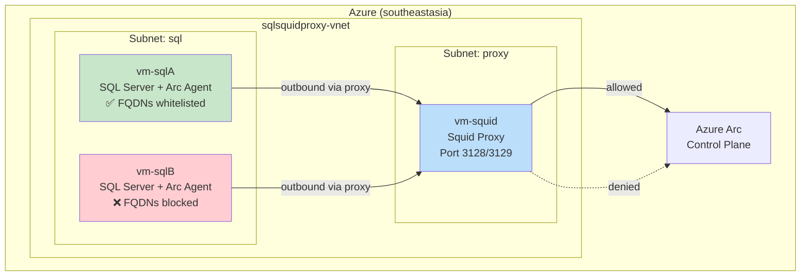

# SQL Server Arc Onboarding Behind Squid Proxy

Simulate two SQL Server instances joining Azure Arc through a Squid transparent proxy. **Server A** has the required FQDNs whitelisted and onboards successfully. **Server B** does not — and fails. See firsthand how proxy-based network controls affect Arc onboarding.

> **Source code**: [ibranibeny/SimulateSQLServerBehindSquidProxy](https://github.com/ibranibeny/SimulateSQLServerBehindSquidProxy)

---

## Architecture



**Key design points:**
- NSG rules block direct outbound internet from SQL VMs — all traffic is forced through the Squid proxy subnet
- Squid uses FQDN-based ACLs to allow or deny HTTPS `CONNECT` requests
- All inbound NSG rules are opened for easy SSH/SQL access during the workshop

---

## Prerequisites

- Azure subscription with Contributor access
- Azure CLI (`az`) installed and logged in
- SSH key pair (the deploy script uses `~/.ssh/id_rsa.pub`)
- Bash shell (Linux, macOS, or WSL)

---

## Step-by-Step Walkthrough

### 1. Deploy the environment

```bash
bash deploy.sh
```

This creates:
- Resource group `sqlsquidproxy` in `southeastasia`
- VNet with proxy and SQL subnets
- 3 VMs with NSGs (outbound restricted on SQL VMs)
- Squid proxy configured with two ACL profiles
- Arc connected machine agent configured with proxy

> **Important**: The deploy script attempts to install SQL Server on both SQL VMs via `az vm run-command invoke`. This step can **fail silently** if the Squid proxy blocks `packages.microsoft.com` or `pmc-geofence.trafficmanager.net`. If SQL Server is not running after deployment, follow the [manual SQL Server installation](#manual-sql-server-installation) steps below.

### 2. Open inbound NSG rules

```bash
bash scripts/open-nsg-inbound.sh
```

Adds an `AllowAllInbound` rule (priority 100) to every NSG in the resource group. This is for workshop access only — not for production.

### 3. Start VMs (if deallocated)

```bash
bash scripts/start-vms.sh
```

### 4. Check service status

```bash
bash scripts/check-services.sh
```

This SSHs into each VM and checks:
- **vm-squid**: Squid process running, listening on 3128/3129
- **vm-sqlA**: SQL Server running, Arc agent status
- **vm-sqlB**: SQL Server running, Arc agent status

### 5. Verify SQL Server is installed

Before checking Arc onboarding, confirm SQL Server is actually running on both VMs:

```bash
# On each SQL VM
ssh azureuser@<vm-public-ip>
systemctl status mssql-server
```

If the service is not found or not running, SQL Server was not installed during deployment. See [Manual SQL Server Installation](#manual-sql-server-installation) below.

You can also verify from the Arc agent:

```bash
azcmagent show | grep "MSSQL Server Detected"
# Expected: MSSQL Server Detected : true
```

### 6. Verify the Arc onboarding difference

| | vm-sqlA (whitelisted) | vm-sqlB (blocked) |
|---|---|---|
| `azcmagent show` | **Connected** | **Disconnected** / Error |
| Squid access log | `TCP_TUNNEL/200 CONNECT` for Arc FQDNs | `TCP_DENIED/403` for Arc FQDNs |
| Azure Portal | Visible in Arc → Servers | Not visible |

SSH into each VM and compare:

```bash
# On vm-sqlA
azcmagent show | grep -E "Agent Status|Resource Name"
# Expected: Agent Status = Connected

# On vm-sqlB
azcmagent show | grep -E "Agent Status|Resource Name"
# Expected: Agent Status = Disconnected (or connection error)
```

Check Squid logs on `vm-squid`:

```bash
tail -100 /var/log/squid/access.log | grep -E "DENIED|arc|login"
```

---

## Manual SQL Server Installation

If the `deploy.sh` script's SQL Server installation failed (common when the proxy blocks package repository FQDNs), follow these steps on each SQL VM.

> **Root cause**: The `packages.microsoft.com` repo uses a CDN that redirects through `pmc-geofence.trafficmanager.net`. If this domain is not whitelisted in Squid, `apt` cannot download the SQL Server packages.

### 1. Add `.trafficmanager.net` to Squid whitelist

SSH into `vm-squid` and add the domain to the `general_allowed` ACL in `/etc/squid/squid.conf`:

```bash
ssh azureuser@<squid-public-ip>
sudo nano /etc/squid/squid.conf
```

Add `.trafficmanager.net` to the `general_allowed` ACL:

```
acl general_allowed dstdomain .ubuntu.com .canonical.com .microsoft.com .azure.com .windows.net .aka.ms .trafficmanager.net
```

Restart Squid:

```bash
sudo systemctl restart squid
```

### 2. Install SQL Server on each SQL VM

SSH into each SQL VM (`vm-sqlA` and `vm-sqlB`) and run:

```bash
ssh azureuser@<sql-vm-public-ip>

# Set proxy for apt
export http_proxy="http://10.0.1.4:3128"
export https_proxy="http://10.0.1.4:3128"

# Import the Microsoft GPG key
curl -fsSL https://packages.microsoft.com/keys/microsoft.asc | sudo gpg --dearmor -o /usr/share/keyrings/microsoft-prod.gpg

# Register the SQL Server repo
echo "deb [arch=amd64 signed-by=/usr/share/keyrings/microsoft-prod.gpg] https://packages.microsoft.com/ubuntu/22.04/mssql-server-2022 jammy main" | \
  sudo tee /etc/apt/sources.list.d/mssql-server-2022.list

# Install SQL Server
sudo apt-get update
sudo apt-get install -y mssql-server

# Configure SQL Server (Developer edition, set SA password)
sudo MSSQL_SA_PASSWORD='SqlP@ssw0rd2026!' \
     MSSQL_PID='developer' \
     ACCEPT_EULA='Y' \
     /opt/mssql/bin/mssql-conf setup

# Verify
systemctl status mssql-server
```

### 3. Verify Arc detects SQL Server

After SQL Server is installed and running, the Arc agent should detect it:

```bash
azcmagent show | grep "MSSQL Server Detected"
# Expected: MSSQL Server Detected : true
```

If the `LinuxAgent.SqlServer` extension is not present or is stuck, you may need to recreate it:

```bash
# Delete stuck extension (run from your local machine)
az connectedmachine extension delete \
  --machine-name vm-sqlA \
  -g sqlsquidproxy \
  --name LinuxAgent.SqlServer \
  --yes --no-wait

# Wait a minute, then recreate
az connectedmachine extension create \
  --machine-name vm-sqlA \
  -g sqlsquidproxy \
  --name LinuxAgent.SqlServer \
  --type LinuxAgent.SqlServer \
  --publisher Microsoft.AzureData
```

---

## Azure Arc Required FQDNs

These are the endpoints that must be whitelisted in the Squid proxy for a successful Arc onboarding in `southeastasia`:

| FQDN | Purpose |
|------|---------|
| `login.microsoftonline.com` | Entra ID authentication |
| `*.login.microsoft.com` | Entra ID authentication |
| `pas.windows.net` | Entra ID authentication |
| `management.azure.com` | Azure Resource Manager |
| `*.his.arc.azure.com` | Hybrid Identity Service |
| `*.guestconfiguration.azure.com` | Extension management |
| `guestnotificationservice.azure.com` | Notifications |
| `*.guestnotificationservice.azure.com` | Notifications |
| `*.servicebus.windows.net` | Notification relay |
| `*.southeastasia.arcdataservices.com` | Arc data processing (SQL) |
| `download.microsoft.com` | Agent installation |
| `packages.microsoft.com` | Agent installation |
| `*.trafficmanager.net` | CDN redirect for packages.microsoft.com |
| `www.microsoft.com/pkiops/certs` | Certificate updates |
| `dc.services.visualstudio.com` | Telemetry (optional) |

> Full list: [Azure Arc network requirements](https://learn.microsoft.com/azure/azure-arc/network-requirements-consolidated#azure-arc-enabled-servers)

---

## Troubleshooting

| Problem | Check |
|---------|-------|
| Can't SSH to VMs | Run `bash scripts/open-nsg-inbound.sh` to open inbound rules |
| Squid not running | `ssh vm-squid "systemctl status squid"` |
| Arc agent can't connect | Check proxy is set: `azcmagent config get proxy.url` |
| All FQDNs blocked | Verify Squid ACLs: `ssh vm-squid "cat /etc/squid/squid.conf"` |
| SSL handshake errors | Squid may need `squid-openssl` package for ssl_bump |
| vm-sqlA also failing | NSG may be blocking outbound to proxy subnet — check NSG rules |
| iptables not redirecting | Ensure rules exclude proxy VM IP: `iptables -t nat -L` |
| SQL Server not installed | `deploy.sh` install can fail silently if proxy blocks `packages.microsoft.com` or `pmc-geofence.trafficmanager.net`. Add `.trafficmanager.net` to Squid whitelist and install manually — see [Manual SQL Server Installation](#manual-sql-server-installation) |
| Arc agent shows `MSSQL Server Detected: false` | SQL Server is not installed or not running. Install it first, then restart the Arc agent: `sudo azcmagent connect ...` or wait for the next heartbeat |
| `LinuxAgent.SqlServer` extension stuck (null provisioningState) | Delete the extension with `--no-wait` flag and recreate it — see [Verify Arc detects SQL Server](#3-verify-arc-detects-sql-server) |

---

## Cleanup

```bash
bash destroy.sh
```

This deletes the entire `sqlsquidproxy` resource group and all resources within it.

---

## References

- [Azure Arc network requirements](https://learn.microsoft.com/azure/azure-arc/network-requirements-consolidated#azure-arc-enabled-servers)
- [Manage Arc agent proxy settings](https://learn.microsoft.com/azure/azure-arc/servers/manage-agent-proxy-settings)
- [SQL Server enabled by Azure Arc](https://learn.microsoft.com/sql/sql-server/azure-arc/overview)
- [Squid proxy documentation](https://wiki.squid-cache.org/)
