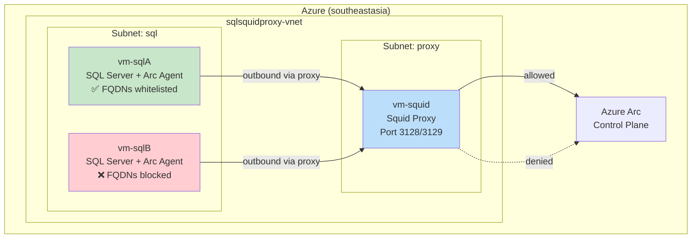

# SQL Server Arc Onboarding Behind Squid Proxy

Simulate two SQL Server instances joining Azure Arc through a Squid transparent proxy. **Server A** has the required FQDNs whitelisted and onboards successfully. **Server B** does not — and fails. See firsthand how proxy-based network controls affect Arc onboarding.

> **Source code**: [ibranibeny/SimulateSQLServerBehindSquidProxy](https://github.com/ibranibeny/SimulateSQLServerBehindSquidProxy)

---

## Architecture



**Key design points:**
- NSG rules block direct outbound internet from SQL VMs — all traffic is forced through the Squid proxy subnet
- Squid uses FQDN-based ACLs to allow or deny HTTPS `CONNECT` requests
- All inbound NSG rules are opened for easy SSH/SQL access during the workshop

---

## Prerequisites

- Azure subscription with Contributor access
- Azure CLI (`az`) installed and logged in
- SSH key pair (the deploy script uses `~/.ssh/id_rsa.pub`)
- Bash shell (Linux, macOS, or WSL)

---

## Step-by-Step Walkthrough

### 1. Deploy the environment

```bash
bash deploy.sh
```

This creates:
- Resource group `sqlsquidproxy` in `southeastasia`
- VNet with proxy and SQL subnets
- 3 VMs with NSGs (outbound restricted on SQL VMs)
- Squid proxy configured with two ACL profiles
- SQL Server installed on both SQL VMs
- Arc connected machine agent configured with proxy

### 2. Open inbound NSG rules

```bash
bash scripts/open-nsg-inbound.sh
```

Adds an `AllowAllInbound` rule (priority 100) to every NSG in the resource group. This is for workshop access only — not for production.

### 3. Start VMs (if deallocated)

```bash
bash scripts/start-vms.sh
```

### 4. Check service status

```bash
bash scripts/check-services.sh
```

This SSHs into each VM and checks:
- **vm-squid**: Squid process running, listening on 3128/3129
- **vm-sqlA**: SQL Server running, Arc agent status
- **vm-sqlB**: SQL Server running, Arc agent status

### 5. Verify the Arc onboarding difference

| | vm-sqlA (whitelisted) | vm-sqlB (blocked) |
|---|---|---|
| `azcmagent show` | **Connected** | **Disconnected** / Error |
| Squid access log | `TCP_TUNNEL/200 CONNECT` for Arc FQDNs | `TCP_DENIED/403` for Arc FQDNs |
| Azure Portal | Visible in Arc → Servers | Not visible |

SSH into each VM and compare:

```bash
# On vm-sqlA
azcmagent show | grep -E "Agent Status|Resource Name"
# Expected: Agent Status = Connected

# On vm-sqlB
azcmagent show | grep -E "Agent Status|Resource Name"
# Expected: Agent Status = Disconnected (or connection error)
```

Check Squid logs on `vm-squid`:

```bash
tail -100 /var/log/squid/access.log | grep -E "DENIED|arc|login"
```

---

## Azure Arc Required FQDNs

These are the endpoints that must be whitelisted in the Squid proxy for a successful Arc onboarding in `southeastasia`:

| FQDN | Purpose |
|------|--------|
| `login.microsoftonline.com` | Entra ID authentication |
| `*.login.microsoft.com` | Entra ID authentication |
| `pas.windows.net` | Entra ID authentication |
| `management.azure.com` | Azure Resource Manager |
| `*.his.arc.azure.com` | Hybrid Identity Service |
| `*.guestconfiguration.azure.com` | Extension management |
| `guestnotificationservice.azure.com` | Notifications |
| `*.guestnotificationservice.azure.com` | Notifications |
| `*.servicebus.windows.net` | Notification relay |
| `*.southeastasia.arcdataservices.com` | Arc data processing (SQL) |
| `download.microsoft.com` | Agent installation |
| `packages.microsoft.com` | Agent installation |
| `www.microsoft.com/pkiops/certs` | Certificate updates |
| `dc.services.visualstudio.com` | Telemetry (optional) |

> Full list: [Azure Arc network requirements](https://learn.microsoft.com/azure/azure-arc/network-requirements-consolidated#azure-arc-enabled-servers)

---

## Troubleshooting

| Problem | Check |
|---------|-------|
| Can't SSH to VMs | Run `bash scripts/open-nsg-inbound.sh` to open inbound rules |
| Squid not running | `ssh vm-squid "systemctl status squid"` |
| Arc agent can't connect | Check proxy is set: `azcmagent config get proxy.url` |
| All FQDNs blocked | Verify Squid ACLs: `ssh vm-squid "cat /etc/squid/squid.conf"` |
| SSL handshake errors | Squid may need `squid-openssl` package for ssl_bump |
| vm-sqlA also failing | NSG may be blocking outbound to proxy subnet — check NSG rules |
| iptables not redirecting | Ensure rules exclude proxy VM IP: `iptables -t nat -L` |

---

## Cleanup

```bash
bash destroy.sh
```

This deletes the entire `sqlsquidproxy` resource group and all resources within it.

---

## References

- [Azure Arc network requirements](https://learn.microsoft.com/azure/azure-arc/network-requirements-consolidated#azure-arc-enabled-servers)
- [Manage Arc agent proxy settings](https://learn.microsoft.com/azure/azure-arc/servers/manage-agent-proxy-settings)
- [SQL Server enabled by Azure Arc](https://learn.microsoft.com/sql/sql-server/azure-arc/overview)
- [Squid proxy documentation](https://wiki.squid-cache.org/)
